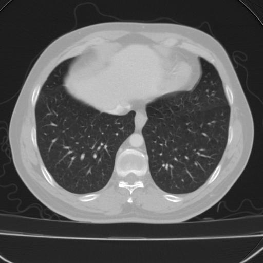
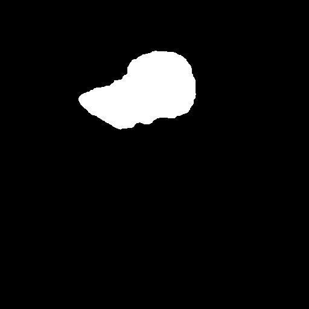
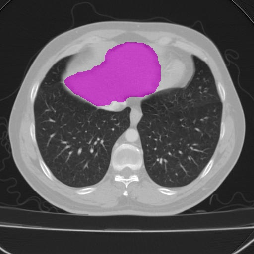
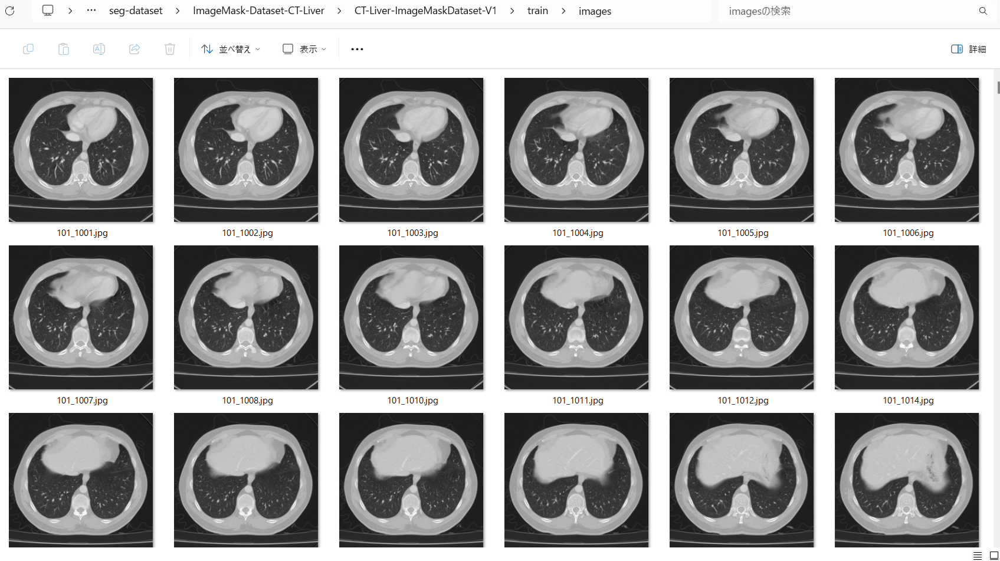
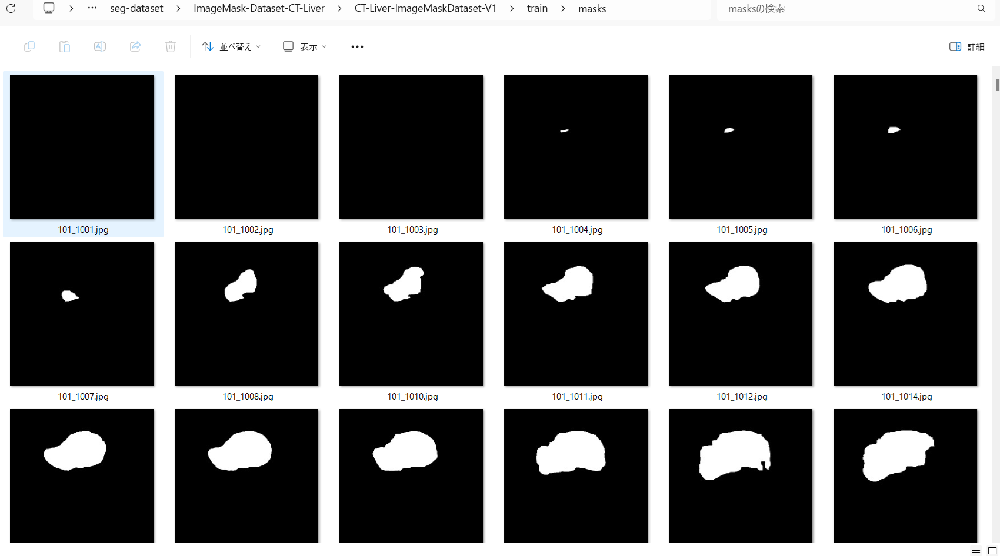
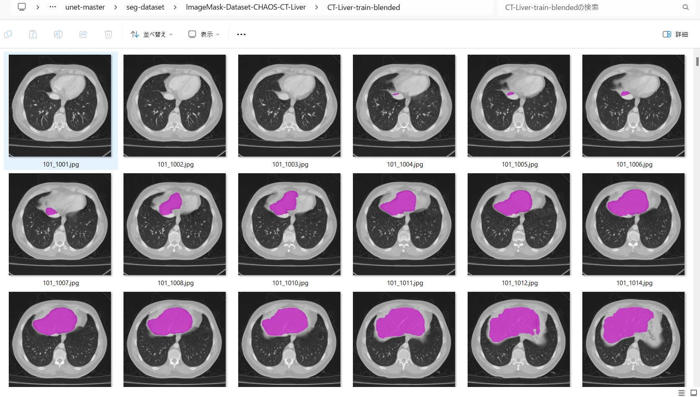
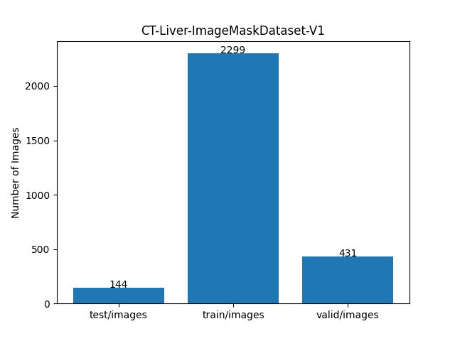

<h2>ImageMask-Dataset-CHAOS-CT-Liver (2024/05/16) </h2>
This is a simple ImageMask Dataset for CHAOS-CT-Liver Image Segmentation. 
The original dataset used here has been taken from the following web-site.
 
<a href="https://chaos.grand-challenge.org/Download/">
Combined 
Healthy 
Abdominal 
Organ 
Segmentation
</a>
 
 
<b>Image and mask sample</b> 

<table>
<tr>
<th>
Image 
</th>
<th>
Mask
</th>
<th>
Image+Mask
</th>

</tr>

<td>

</td>
<td>

</td>
<td>

</td>

</table>

 
<b>Download CHAOS-CT-Liver-ImageMaskDataset</b> 
You can download our 512x512 jpg CHAOS-CT-Liver dataset generated here from the google drive 
<a href="https://drive.google.com/file/d/1etFEBSESEUhDIXOroyjSnqK4yGjdaMNU/view?usp=sharing">CT-Liver-ImageMaskDataset-V1.zip</a>.
 
 
<h3>1. Dataset Citation</h3>
The original dataset used here has been taken from the following web-site. 

<b>
<a href="https://chaos.grand-challenge.org/Download/">
 Combined  Healthy  Abdominal  Organ  Segmentation 
</a>
</b>
 

CHAOS dataset can be downloaded via the link below.  
 
https://doi.org/10.5281/zenodo.3362844 
 
All participants are considered to have read and accepted the Rules.  
The data is licensed under Attribution-NonCommercial-ShareAlike 4.0 International.   
The data can be downloaded via the link below: 
 
https://doi.org/10.5281/zenodo.3362844 
 
In your works, please give appropriate credit, provide 
<a href="https://chaos.grand-challenge.org/Publications/">a link</a> 
to the license, and indicate if changes were made. 
 
The citation information can be found in the 
<a href="https://chaos.grand-challenge.org/Publications/"><b>Publications and Citation</b> </a>page.
 

<h3>2. Download CHAOS dataset </h3>
If you would like to generate your own dataset by yourself, please download the original CHAOS dataset from 
the following <a href="https://zenodo.org/records/3431873">
CHAOS - Combined (CT-MR) Healthy Abdominal Organ Segmentation Challenge Data
</a>
 
Please download 
<a href="https://zenodo.org/records/3431873/files/CHAOS_Train_Sets.zip?download=1">
CHAOS_Train_Sets.zip
</a>
, and expand the downloaded Train_Sets file in your working folder. 
 It contains CT and MR datasets as shown below. 
<pre>
./Train_Sets
├─CT
└─MR
</pre>
The folder structure of <b>Train_Sets/CT</b> is the following. 
<pre>
./Train_Sets/CT
├─1
│  ├─DICOM_anon
│  └─Ground
├─2
│  ├─DICOM_anon
│  └─Ground
 ...
└─30
    ├─DICOM_anon
    └─Ground
</pre>
Each DICOM_anon of the numbered folder contains a lot of DICOM dcm files files, and Ground corresponding mask png files as shown below.
<pre>
,/DICOM_anon
├─i0000,0000b.dcm
├─i0001,0000b.dcm
├─i0002,0000b.dcm
...
└─i0095,0000b.dcm
</pre>
<pre>
,/Ground
├─liver_GT_000.png
├─liver_GT_001.png
├─liver_GT_002.png
...
└─liver_GT_095.png
</pre>

<h3>3. Generate master dataset </h3>
Please move to <b>ImageMask-Dataset-CHAOS-CT-Liver</b> direcotory, and run the following commnad for Python 
script <a href="./CTImageMaskDatasetGenerator.py">CTImageMaskDatasetGenetator.py</a> to generate
images and masks jgp files. 
<pre>
>python CTImageMaskDatasetGenerator.py 
</pre>
, by which <b>CT-Liver-master</b> datatset will be created. 
<pre>
./CT-Liver-master
  ├─images
  └─masks
</pre>

<h3>4. Split master dataset </h3>
Please run the following command for Python script <a href="./split_master.py">split_master.py</a>.
<pre>
>python split_master.py
</pre>
, by wich test, train, and valid subdatasets will be created. 

<pre>
./CT-Liver-ImageMaskDataset-V1
├─test
│  ├─images
│  └─masks
├─train
│  ├─images
│  └─masks
└─valid
    ├─images
    └─masks
</pre>

Train images sample 
 
Train masks sample 
 

Validation (Image + Mask) 

 
 
Dataset Statistics  

 

